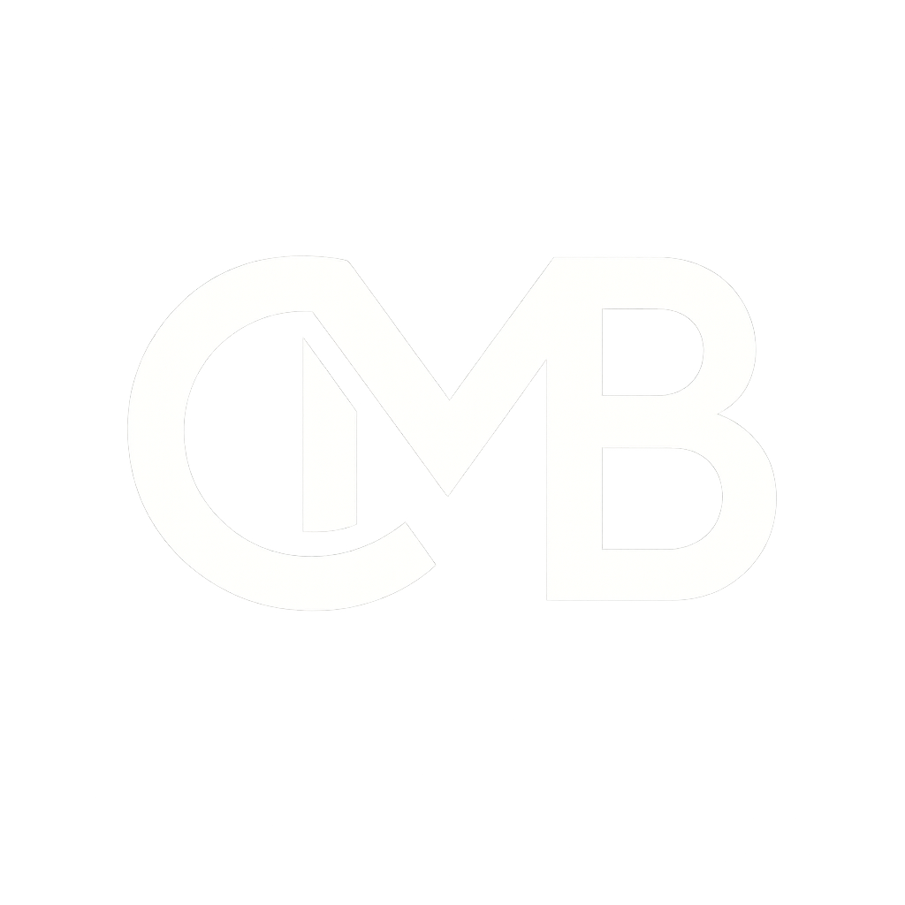
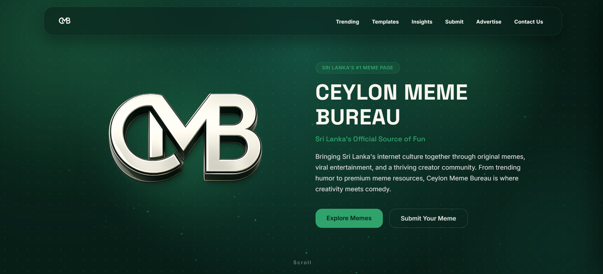
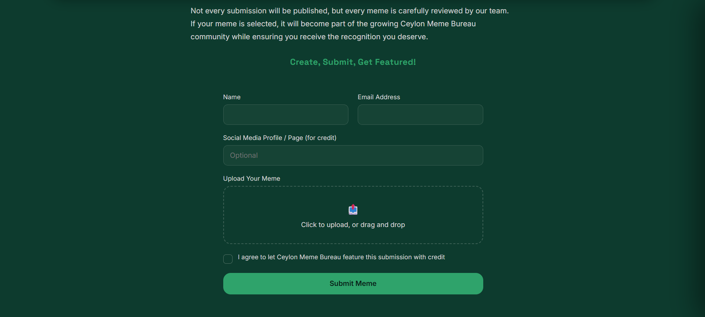
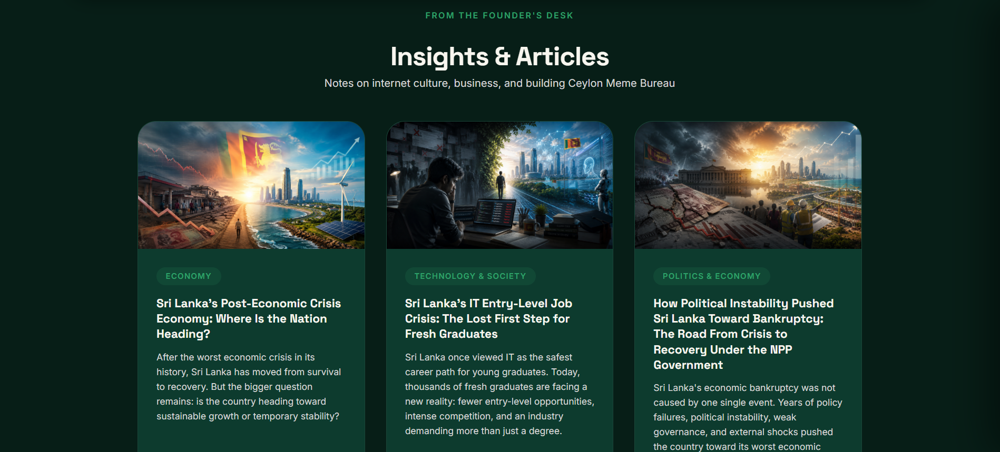
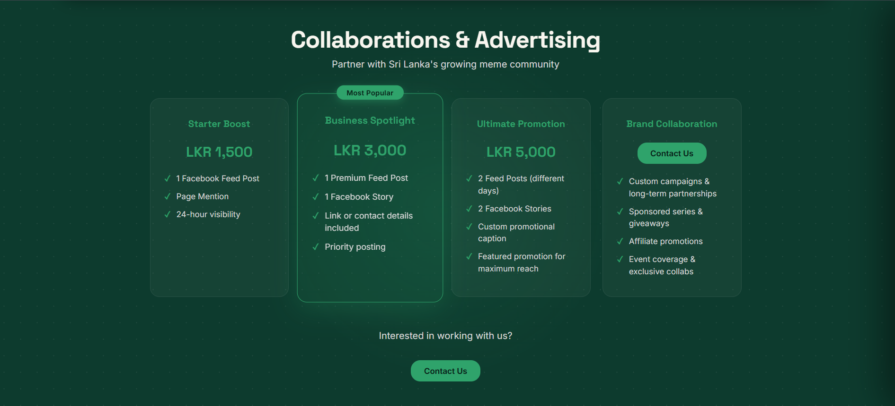

<div align="center">



# Ceylon Meme Bureau

### *Sri Lanka's Official Source of Fun*

A full-featured, custom-built website for Sri Lanka's growing meme community —
built from scratch with HTML, CSS, and JavaScript.


</div>

---

## 📖 About This Project

This website was designed and developed for **Ceylon Meme Bureau**, a Sri Lankan
meme and entertainment page with an active audience across Facebook, Instagram,
TikTok, and YouTube. Founded in 2023, the page has grown into a recognizable
brand within Sri Lanka's internet culture.

The client needed a professional, standalone website to complement their social
media presence — a central hub where their audience could engage with content,
submit memes, and where businesses could inquire about advertising, alongside
long-form written content from the founder.

This project was built **entirely from scratch** — no website builders, no
templates — as a hands-on exercise in real-world frontend development,
covering everything from layout and design systems to interactivity and
deployment.

---

## ✨ Features

| Feature | Description |
|---|---|
| 🔥 **Trending Memes** | A ranked weekly showcase of the page's top-performing memes, with engagement stats. |
| 🖼️ **Meme Template Gallery** | Categorized, downloadable meme templates (Politics, Movies, Viral, Others) for the community to use. |
| 📤 **Meme Submission Form** | Lets users upload and submit their own original memes for a chance to be featured, with credit given to the creator. |
| 📰 **Insights & Articles** | Long-form written pieces by the founder on internet culture, business, and the Sri Lankan economy — with a full article listing and individual article pages. |
| 🤝 **Collaborations & Advertising** | Clear, tiered advertising packages (Starter, Business Spotlight, Ultimate Promotion) plus a custom brand collaboration option, for businesses looking to partner with the page. |
| 👤 **About / Founder Story** | A brand timeline and founder profile, sharing the page's history and mission. |
| 📱 **Fully Responsive** | Optimized layout and navigation for both desktop and mobile, including a custom animated mobile menu. |

---

---

## 📸 Screenshots

### 🏠 Homepage


The landing page introduces Ceylon Meme Bureau with an animated hero section,
brand story, and quick navigation into the site's core features — trending
memes, the template gallery, and submission form.

### 📤 Meme Submission Form


A simple, guided form where users can upload their original memes for a
chance to be featured on the page's official platforms, with clear submission
guidelines and consent checkboxes built in.

### 📰 Articles & Insights


A blog-style section featuring long-form articles written by the founder,
covering Sri Lankan internet culture, economics, and behind-the-scenes
thoughts on building the page.

### 🤝 Collaborations & Advertising


Clear, tiered advertising packages designed for local businesses looking to
promote themselves through the page's social reach, alongside a custom
collaboration option for larger partnerships.

---

## 🛠️ Tech Stack

- **Frontend:** HTML5, CSS3 (custom design system using CSS variables), Vanilla JavaScript
- **Fonts:** [Space Grotesk](https://fonts.google.com/specimen/Space+Grotesk) (headings), [Inter](https://fonts.google.com/specimen/Inter) (body)
- **Backend / Data handling:** Google Apps Script (handles meme submission uploads)
- **Hosting:** GitHub Pages / Netlify

---

## 📂 Project Structure

```
ceylon-meme-bureau/
│
├── index.html              # Homepage — hero, about, trending preview, gallery, submit, collab
├── trending.html           # Full trending memes listing
├── templates.html          # Meme template gallery, filterable by category
├── articles.html           # Full articles / insights listing
├── article.html            # Single article view (reads ?slug= from the URL)
│
├── css/
│   └── style.css           # Shared design system + styles for every page
│
├── js/
│   ├── script.js           # Homepage interactivity — particles, counters, forms, spotlight
│   ├── nav.js               # Shared navbar + mobile menu behavior (all pages)
│   ├── templates.js        # Template filtering + download logic
│   ├── articles-data.js    # Article content (acts as a simple local database)
│   └── articles.js         # Renders article cards + single article pages
│
└── assets/
    └── images/             # Logos, meme thumbnails, template previews, article covers
```
---


## 🎨 Design Philosophy

The site uses a **dark green and off-white** palette matching the brand's
existing logo, paired with a "sticker board" visual style — rounded cards,
soft glows, and playful hover interactions — to reflect the fun, community-driven
nature of the content while still feeling like a professional, trustworthy
platform for advertisers.

---

## 🚀 Deployment

This site is deployed as a static site via **GitHub Pages / Netlify**, requiring
no server-side runtime for the core browsing experience. The meme submission
form connects to a lightweight backend to handle image uploads.

---

## 👤 Credits

**Client / Founder:** Quintus Wijemanna — Ceylon Meme Bureau
**Development:** Built independently as a client project, covering design,
frontend development, interactivity, and deployment.

---

<div align="center">

*© 2026 Ceylon Meme Bureau. All rights reserved.*

</div>